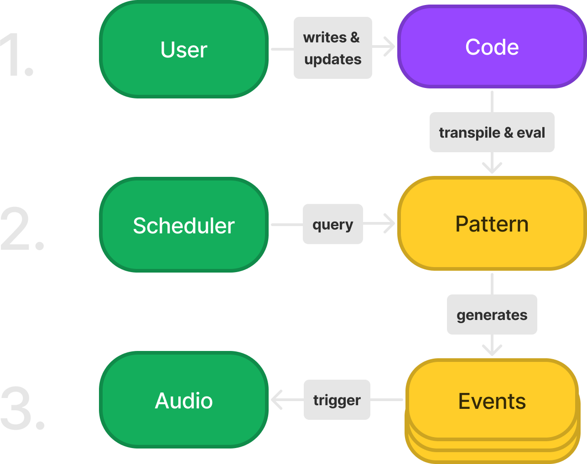

# Introduction

In the following paper, we introduce *Strudel*, an alternative
implementation of the TidalCycles (or 'Tidal' for short) live coding
system, using the JavaScript programming language. Strudel is an
attempt to make live coding more accessible, by creating a system that
runs entirely in the browser, while opening Tidal's approach to
algorithmic patterns [@mcleanAlgorithmicPattern2020a] up to modern
audio/visual web technologies. The Strudel REPL is a live code editor
dedicated to manipulating patterns while they play, with builtin
visual feedback. While Strudel is written in JavaScript, the API is
optimized for simplicity and readability by applying code
transformations on the syntax tree level, allowing language operations
that would otherwise be impossible. The application supports multiple
ways to output sound, including Tone.js, Web Audio Nodes, OSC (Open
Sound Control) messages, Web Serial, Web MIDI and Csound. The project
is split into multiple packages, allowing granular reuse in other
applications. Apart from TidalCycles, Strudel draws inspiration from
many prior existing projects like TidalVortex
[@mcleanTidalVortexZero2022], Gibber [@robertsGibberLiveCoding2012],
Estuary [@ogbornEstuaryBrowserbasedCollaborative2017], Hydra
[@jackHydra2022], Ocarina [@solomonPurescriptocarina2022] and
Feedforward [@mcleanFeedforward2020]. This paper expands the Strudel
Demo paper for the Web Audio Conference 2022 [@StrudelWAC2022].

The first tentative commit to the Strudel project was on 22nd January
2022 by Alex McLean, with the core representation implemented over the
following few days. Although this was his first attempt at a
JavaScript-based application, by 27th January, Alex had managed to
upload the initial version to the 'npm' javascript package database,
sharing with the wider community for comment. By 4th February, Felix
Roos had discovered Strudel and contributed a 'REPL' user interface to
it, and then contributed a scheduler the next day, so that Strudel
could already make sound.  At this point, Alex and Felix shared
ownership to the repository, and the project has since proved to be a
productive confluence of Felix's own work into music representation
and visualisation, with Alex's experience with making Tidal. Felix has
since become the primary contributor to Strudel, with Alex continuing
to jump between developing both Strudel and Tidal. Aspects of
Strudel's development have therefore fed back into TidalCycles, and
both systems have maintained a shared conceptual underpinning. We plan
to continue working towards feature parity between these systems,
although within the syntactical trade-offs and library ecosystems of
JavaScript and Haskell, some divergence is inevitable and healthy.

Over the first year of its life, Strudel is now a fully-fledged live
coding environment, porting Tidal's core represention of patterns,
pattern transformations, and mini-notation for polymetric sequences,
combined with a wealth of features for synthesising and visualising
those patterns.

# From Tidal to Strudel and back

As mentioned above, the original Tidal is implemented as a domain specific language (DSL) embedded in the Haskell pure functional programming language, and takes advantage of Haskell's terse syntax and advanced, 'strong' type system. JavaScript on the other hand, is a multi-paradigm programming language, with a dynamic type system. Because Tidal leans heavily on many of Haskell's more unique features, it was not always clear that it could meaningfully be ported to a multi-paradigm scripting language. However, this possibility was already demonstrated with an earlier port to Python [TidalVortex; @mcleanTidalVortexZero2022], and we have now successfully implemented Tidal's pure functional representation of patterns in Strudel, including partial application, currying, and the functor, applicative and monadic structures that underlie Tidal's expressive pattern transformations. The result is a terse and highly composable system, where everything is either a pattern, or a function for combining and manipulating patterns, offering a rich creative ground for exploration.

This development process has been far from a one-way port, however. The process of porting Tidal's concepts has also opened up new possibilities, some just from revisiting every design decision, and some from the particular affordances and constraints offered by JavaScript. This has lead to new features (and indeed bugfixes) that have found their way back to Tidal where appropriate, and ongoing work that we will return to in the conclusion of this paper.

# Representing Patterns

Patterns are the essence of Tidal. Its patterns are abstract entities that represent flows of time as functions, adapting a technique called pure functional reactive programming. Taking a time span as its input, a Pattern can output a set of events that happen within that time span. It depends on the structure of the Pattern how the events are located in time.
From now on, this process of generating events from a time span will be called **querying**.
Example:

```js
const pattern = sequence(c3, [e3, g3])
const events = pattern.queryArc(0, 1)
console.log(events.map(e => e.show()))
```

In this example, we create a pattern using the `sequence` function and **query** it for the time span from `0` to `1`.
Those numbers represent units of time called **cycles**. The length of one cycle depends on the tempo, which defaults to one cycle per second.
The resulting events are:

```js
 ["[ 0/1 -> 1/2 | c3 ]", 
  "[ 1/2 -> 3/4 | e3 ]", 
  "[ 3/4 -> 1/1 | g3 ]"
 ]
```

Each event has a value, a begin time and an end time, where time is represented as a fraction. In the above case, the events are placed in sequential order, where c3 takes the first half, and e3 and g3 together take the second half. This temporal placement is the result of the `sequence` function, which divides its arguments equally over one cycle. If an argument is an array, the same rule applies to that part of the cycle. In the example, e3 and g3 are divided equally over the second half of the whole cycle.

Note that the query function is not just a way to access a pattern, but true to the principles of functional programming, is the pattern itself. This means that in theory there is no way to change a pattern, it is opaque as a pure function. In practice though, Strudel and Tidal are all about transforming patterns, so how is this done? The answer is, by replacing the pattern with a new one, that calls the old one. This new one is only able to manipulate the query before passing it to the old pattern, and manipulate the results from it before returning them to caller. But, this is enough to support all the temporal and structural manipulations provided by Strudel (and Tidal's) extensive library of functions.

The above examples do not represent how Strudel is used in practice. In the live coding editor, the user only has to type in the pattern itself, the querying will be handled by the scheduler. The scheduler will repeatedly query the pattern for events, which are then scheduled as sound synthesis or other event triggers.
Also, the above event data structure has been simplified for readability.

{ width=60% }

# Making Patterns

In practice, the end-user live coder will not deal with constructing patterns directly, but will rather build patterns using Strudel's extensive combinator library to create, combine and transform patterns.

The live coder will rarely use the `sequence` function as seen above, as sequencing is implicit in many functions. For example in the following, the `note` function constructs a pattern of notes, sequencing its arguments in the same manner as the previous example.

```js
note(c3, [e3, g3])
```

Perhaps more often, they will use the mini-notation for even terser notation of rhythmic sequences: ^[This last example is also valid Tidal code, albeit the parenthesis is not required in its Haskell syntax in this case. Tidal does not support passing sequences as lists directly to the `note` function, however.].

```js
note("c3 [e3 g3]")
```

Such sequences are often treated only as a starting point for manipulation, where they then undergo pattern transformations such as repetition, symmetry, interference/combination or randomisation, potentially at multiple timescales. Because Strudel patterns are represented as pure functions of time rather than as data structures, very long and complex generative results can be represented and manipulated without having to store the resulting sequences in memory.

# Pattern Example

The following example showcases how patterns can be utilized to create musical complexity from simple parts, using repetition and interference:

```js
"<0 2 [4 6](3,4,1) 3>"
.off(1/4, add(2))
.off(1/2, add(6))
.scale('D minor')
.legato(.25)
.note().s("sawtooth square")
.delay(.8).delaytime(.125)
```

The pattern starts with a rhythm of numbers in mini-notation, which are later interpreted inside the scale of D minor.
The first line could also be expressed without mini-notation:

```js
cat(0, 2, [4, 6].euclid(3, 4, 1), 3)
```

These numbers then undergo various pattern transformations. Here is a short description of all the functions used:

- `cat`: play elements sequentially, where each lasts one cycle
- `brackets`: elements inside brackets are divided equally over the time of their parent
- `.euclid(p, s, o)`: place p pulses evenly over s steps, with offset o [@toussaintEuclideanAlgorithmGenerates2005]
- `.off(n, f)`: layers a pattern on top of itself, with the new layer offset by n cycles, and with function f applied
- `.legato(n)`: multiply the duration of all events in a pattern by a factor of n
- `.echo(t, n, v)`: copy each event t times, with n cycles in between each copy, decreasing velocity by v
- `.note()`: interpretes values as notes
- `.s(name)`: play back each event with the given sound
- `.delay(wet)`: add delay
- `.delaytime(t)`: set delay time

Much of the above will be familiar to Tidal users.

<!-- This example shows some of Strudel's unique support for chords and transposition familiar to students of Western music theory. This differs a little from Tidal's approach and thanks to the integration of the javascript library XXX (*TODO* ? or is this all your work Felix?), Strudel's support for tonal transformations such as voice leading is perhaps respects more advanced than Tidal. -->

# Ways to make Sound (and other events)

To generate sound, Strudel supports bindings for different outputs:

- Tone.js (deprecated)
- Web Audio API
- WebDirt, a js recreation of Tidal's *Dirt* sample engine (deprecated)
- OSC via osc-js, compatible with superdirt
- Csound via the Csound WebAssembly build
- MIDI via WebMIDI
- Serial via WebSerial

At first, we used Tone.js as sound output, but it proved to be limited for the use case of Strudel, where each individual event could potentially have a completely different audio graph.
While the Web Audio API takes a *fire-and-forget* approach, creating a lot of Tone.js instruments and effects causes performance issues quickly. For that reason, we chose to search for alternatives.

Strudel's new default output uses the Web Audio API to create a new audio graph for each event. It currently supports basic oscillators, sample playback, various effects and an experimental support for soundfonts.

WebDirt [@ogbornDktr0WebDirt2022] was created as part of the Estuary Live Coding System [@ogbornEstuaryBrowserbasedCollaborative2017], and proved to be a solid choice for handling samples in Strudel as well. We are however focused on working more directly with the Web Audio API to be able to integrate new features more tightly.

Using the OSC protocol via Strudel's provided Node.js-based OSC proxy server, it is possible to send network messages to trigger events. This is mainly used to render sound using SuperDirt [@SuperDirt2022], which is the well-developed Supercollider-based synthesis framework that Tidal live coders generally use as standard.

Recently, the experimental integration of Csound proved to bring a new dimension of sound design capabilities to Strudel. Thanks to the WebAssembly distribution of this classic system [@CsoundWebAssembly], Csound 'orchestra' synthesisers can be embedded in and then patterned with Strudel code.

MIDI output can also be used to send MIDI messages to either external instruments or to other programs on the same device. Unlike OSC, Strudel is able to send MIDI directly without requiring additional proxy software, but only from web browsers that support it (at the time of writing, this means Chromium-based browsers).

Finally, Strudel supports Serial output, for example to trigger events
via microcontrollers. This has already been explored for robot
choreography by Kate Sicchio and Alex McLean, via a performance
presented at the International Conference on Live Interfaces 2022.

# The Strudel REPL

While Strudel can be used as a library in any JavaScript codebase, its main, reference user interface is the Strudel REPL^[REPL stands for read, evaluate, print/play, loop. It is friendly jargon for an interactive programming interface from computing heritage, usually for a commandline interface but also applied to live coding editors.], which is a browser-based live coding environment. This live code editor is dedicated to manipulating Strudel patterns while they play. The REPL features built-in visual feedback, highlighting which elements in the patterned (mini-notation) sequences are influencing the event that is currently being played. This feedback is designed to support both learning and live use of Strudel.

Besides a UI for playback control and meta information, the main part of the REPL interface is the code editor powered by CodeMirror. In it, the user can edit and evaluate pattern code live, using one of the available synthesis outputs to create music and/or sound art. The control flow of the REPL follows 3 basic steps:

1. The user writes and updates code. Each update transpiles and evaluates it to create a `Pattern` instance
2. While the REPL is running, the `Scheduler` queries the active `Pattern` by a regular interval, generating `Events` (also known as `Haps` in Strudel) for the next time span.
3. For each scheduling tick, all generated `Events` are triggered by calling their `onTrigger` method, which is set by the output.

{ width=43% }

## User Code

To create a `Pattern` from the user code, two steps are needed:

1. Transpile the JS input code to make it functional
2. Evaluate the transpiled code

### Transpilation & Evaluation

In the JavaScript world, using transpilation is a common practise to be able to use language features that are not supported by the base language. Tools like `babel` will transpile code that contains unsupported language features into a version of the code without those features.

In the same tradition, Strudel can add a transpilation step to simplify the user code in the context of live coding. For example, the Strudel REPL lets the user create mini-notation patterns using just double quoted strings, while single quoted strings remain what they are:

```js
"c3 [e3 g3]*2"
```

is transpiled to:

```js
mini("c3 [e3 g3]*2").withMiniLocation([1,0,0],[1,14,14])
```

Here, the string is wrapped in `mini`, which will create a pattern from a mini-notation string. Additionally, the `withMiniLocation` method passes the original source code location of the string to the pattern, which enables highlighting active events.

Other convenient features like pseudo variables, operator overloading and top level await are possible with transpilation.

After the transpilation, the code is ready to be evaluated into a `Pattern`.

Behind the scenes, the user code string is parsed with `acorn`, turning it into an Abstract Syntax Tree (AST). The AST allows changing the structure of the code before generating the transpiled version using `escodegen`.

### Mini-notation

While the transpilation allows JavaScript to express Patterns in a less verbose way, it is still preferable to use the mini-notation as a more compact way to express rhythm. Strudel aims to provide the same mini-notation features and syntax as used in Tidal.

The mini-notation parser is implemented using `peggy`, which allows generating performant parsers for Domain Specific Languages (DSLs) using a concise grammar notation. The generated parser turns the mini-notation string into an AST which is used to call the respective Strudel functions with the given structure. For example, `"c3 [e3 g3]*2"` will result in the following calls:

```js
seq(
  reify('c3').withLocation([1,1,1], [1,4,4]),
  seq(
    reify('e3').withLocation([1,5,5], [1,8,8]),
    reify('g3').withLocation([1,8,8], [1,10,10]),
  ).fast(2)
)
```

### Highlighting Locations

As seen in the examples above, both the JS and the mini-notation parser add source code locations using `withMiniLocation` and `withLocation` methods. While the JS parser adds locations relative to the user code as a whole, the mini-notation adds locations relative to the position of the mini-notation string. The absolute location of elements within mini-notation can be calculated by simply adding both locations together. This absolute location can be used to highlight active events in real time.

## Scheduling Events

After an instance of `Pattern` is obtained from the user code,
it is used by the scheduler to get queried for events. Once started, the scheduler runs at a fixed interval to query the active pattern for events within the current interval's time span. A simplified implementation looks like this:

```js
let pattern = seq('c3', ['e3', 'g3']); // pattern from user
let interval = 0.5; // query interval in seconds
let time = 0; // beginning of current time span
let minLatency = .1; // min time before a hap should trigger
setInterval(() => {
  const haps = pattern.queryArc(time, time + interval);
  time += interval; // increment time
  haps.forEach((hap) => {
    const deadline = hap.whole.begin - time + minLatency;
    onTrigger(hap, deadline, duration);
  });
}, interval * 1000); // query each "interval" seconds
```

Note that the above code is simplified for illustrative purposes. The actual implementation has to work around imprecise callbacks of `setInterval`. More about the implementation details can be read in [this blog post](https://loophole-letters.vercel.app/web-audio-scheduling).

The fact that `Pattern.queryArc` is a pure function that maps a time span to a set of events allows us to choose any interval we like without changing the resulting output. It also means that when the pattern is changed from outside, the next scheduling callback will work with the new pattern, keeping its clock running.

The latency between the time the pattern is evaluated and the change is heard is between `minLatency` and `interval + minLatency`, in our example between 100ms and 600ms. In Strudel, the current query interval is 50ms with a minLatency of 100ms, meaning the latency is between 50ms and 150ms.

## Output

The last step is to trigger each event in the chosen output.
This is where the given time and value of each event is used to generate audio or any other form of time based output. The default output of the Strudel REPL is the WebAudio output. To understand what an output does, we first have to understand what control parameters are.

### Control Parameters

To be able to manipulate multiple aspects of sound in parallel, so called control parameters are used to shape the value of each event. Example:

```js
note("c3 e3").cutoff(1000).s('sawtooth')
  .queryArc(0, 1).map(hap => hap.value)
/* [
  { note: 'c3', cutoff: 1000, s: 'sawtooth' }
  { note: 'e3', cutoff: 1000, s: 'sawtooth' }
] */
```

Here, the control parameter functions `note`, `cutoff` and `s` are used, where each controls a different property in the value object. Each control parameter function accepts a primitive value, a list of values to be sequenced into a `Pattern`, or a `Pattern`. In the example, `note` gets a `Pattern` from a mini-notation expression (double quoted), while `cutoff` and `s` are given a `Number` and a (single quoted) `String` respectively.

Strudel comes with a large default set of control parameter functions that are based on the ones used by Tidal and SuperDirt, focusing on music and audio terminology. It is however possible to create custom control parameters for any purpose:

```js
const { x, y } = createParams('x', 'y')
x(sine.range(0, 200)).y(cosine.range(0,200))
```

This example creates the custom control parameters `x` and `y` which are then used to form a pattern that descibes the coordinates of a circle.

### Outputs

Now that we know how the value of an event is manipulated using control parameters, we can look at how outputs can use that value to generate anything. The scheduler above was calling the `onTrigger` function which is used to implement the output. A very simple version of the web audio output could look like this:

```js
function onTrigger(hap, deadline, duration) {
  const { note } = hap.value;
  const time = getAudioContext().currentTime + deadline;
  const o = getAudioContext().createOscillator();
  o.frequency.value = getFreq(note);
  o.start(time);
  o.stop(time + event.duration);
  o.connect(getAudioContext().destination);
}
```

The above example will create an `OscillatorNode` for each event, where the frequency is controlled by the `note` param. In essence, this is how the WebAudio API output of Strudel works, only with many more parameters to control synths, samples and effects.

# Pattern alignment and combination

One core aspect of Strudel, inherited from Tidal, is the flexible way that patterns can be combined, irrespective of their structure. Its declarative approach means a live coder does not have to think about the details of *how* this is done, only *what* is to be done.

As a simple example, consider two number patterns `"0 [1 2] 3"`, and `"10 20"`. The first has three contiguous steps of equal lengths, with the second step broken down into two substeps, giving four events in total. There are a very large number of ways in which the structure of these two patterns could be combined, but the default method in both Strudel and Tidal is to line up the cycles of the two patterns, and then take events from the first pattern and match them with those in the second pattern. Therefore, the following two lines are equivalent:

```js
"0 [1 2] 3".add("10 20")
"10 [11 22] 23"
```

Where the events only partially overlap, they are treated as fragments
of the event in the first pattern. This is a little difficult to
conceptualise, but lets start by comparing the two patterns in the
following example:

```js
"0 1 2".add("10 20")
"10 [11 21] 20"
```

They are similar to the previous example in that the number `1` is split in two, with its two halves added to `10` and `20` respectively. However, the `11` 'remembers' that it is a fragment of that original `1` event, and so is treated as having a duration of a third of a cycle, despite only being active for a sixth of a cycle. Likewise, the `21` is also a fragment of that original `1` event, but a fragment of its second half. Because the start of its event is missing, it wouldn't actually trigger a sound (unless it underwent further pattern transformations/combinations).

In practice, the effect of this default, implicit method for combining two patterns is that the second pattern is added *in* to the first one, and indeed this can be made explicit:

```js
"0 1 2".add.in("10 20")
```

This makes way for other ways to align the pattern, and several are already defined, in particular:

* `in` - as explained above, aligns cycles, and applies values from the pattern on the right *in* to the pattern on the left.
* `out` - as with `in`, but values are applied *out* of the pattern on the left (i.e. *in* to the one on the right).
* `mix` - structures from both patterns are combined, so that the new events are not fragments but are created at intersections of events from both sides.
* `squeeze` - cycles from the pattern on the right are squeezed into events on the left. So that e.g. `"0 1 2".add.squeeze("10 20")` is equivalent to `"[10 20] [11 21] [12 22]"`.
* `squeezeout` - as with `squeeze`, but cycles from the left are squeezed into events on the right. So, `"0 1 2".add.squeezeout("10 20")` is equivalent to `[10 11 12] [20 21 22]`.
* `trig` is similar to `squeezeout` in that cycles from the right are aligned with events on the left. However those cycles are not 'squeezed', rather they are truncated to fit the event. So `"0 1 2 3 4 5 6 7".add.trig("10 [20 30]")` would be equivalent to `10 11 12 13 20 21 30 31`. In effect, events on the right 'trigger' cycles on the left.
* `trigzero` is similar to `trig`, but the pattern is 'triggered' from its very first cycle, rather than from the current cycle. `trig` and `trigzero` therefore only give different results where the leftmost pattern differs from one cycle to the next.

We will save going deeper into the background, design and practicalities of these alignment functions for future publications. However in the next section, we take them as a case study for looking at the different design affordances offered by Haskell to Tidal, and JavaScript to Strudel.

# Comparing Strudel and Haskell in use

Unlike Haskell, JavaScript lacks the ability to define custom infix
operators, or change the meaning of existing ones. So the above
Strudel example of `"0 1 2".add.out("10 20")` is equivalent to the
Tidal expression `"0 1 2" +| "10 20"`, where the vertical bar in the
operator `+|` stands for `out` (where `a |+ b` would be equivalent of
`a.add.in(b)`).

From this we can already see that Tidal tends towards brevity through
mixing infix operators with functions, and Strudel tends towards
spelling out operations which are joined together with the `.`
operator. This then is the design trade-off of Tidal's tersity,
versus Strudel's simplicity.

To demonstrate this, consider the following Tidal pattern:

```haskell
iter 4 $ every 3 (||+ n "10 20") $ (n "0 1 3") # s "triangle" # crush 4
```

This can be directly translated to the Strudel equivalent:

```js
iter(4, every(3, add.squeeze("10 20"), n("0 1 3").s("triangle").crush(4)))
```

Although for a more canonical Strudel expression, we would reorder it
as:

```js
n("0 1 3").every(3, add.squeeze("10 20")).iter(4).s("triangle").crush(4)
```

The Strudel example uses the `.` method call operator for all
operations and combinations, whereas the Tidal example has `#` for the
default method for combining patterns and uses infix operators for
other methods. The relative lack of parenthesis in the Tidal example is partly
due to the way that arguments are applied to Haskell's functions, and
partly due to the use of the `$` operator as an alternative way to
establish precedence and control the order of evaluation.

Considering the above, we hypothesise that the Haskell syntax is a little
cleaner, but that the Strudel syntax is easier to learn. Our informal
observation is that while Haskell's dollar `$` operator is very useful
in making code easier to work with, it is one of the most difficult
aspects of Tidal use for beginners to learn. On the other hand, the
deeper levels of parenthesis in Strudel code can be difficult to keep
track of, especially while coding under pressure of live musical
performance. However this difficulty can largely be mitigated by
reordering expressions, and further mitigated by supporting editor
features.

With Strudel, we have little choice but to embrace the affordances and
constraints offered by JavaScript, and while designing a
domain-specific language based on method calls is a
challenge, through creative adoption of functional programming
techniques like partial application, we are so far very happy with the
results. Tidal's functional reactive approach to pattern-making has in
general translated well to JavaScript, and opportunities and
constraints have overall traded off to create a very approachable and
useable live coding environment.

## The trade-off of flexible typing

We have identified one problem with porting Tidal to JavaScript where we have missed Haskell's strict typing and type inference. In both Tidal and Strudel, time is rational, where any point in time is represented as the ratio of two integers. This allows representation of musical ratios such that are impossible to represent accurately using the more common floating point numbers. However while libraries are available that support rational numbers in JavaScript, the lack of strict typing means that it is easy to implement pattern methods where computationally expensive conversion from floating point to rational numbers are performed late, and therefore often enough to overload the CPUs, due to the large number of iterative calculations required to estimate a ratio for a given floating point number. To mitigate this problem, we might consider moving to TypeScript in the future.

# Future Outlook

The project is still young, with many features on the horizon. As general guiding principles, Strudel aims to be

1. accessible
2. consistent with Tidal's approach to pattern
3. modular and extensible

While Haskell's type system makes it a great language for the ongoing development of Tidal's inner representation of pattern, JavaScript's vibrant ecosystem, flexibility and accessibility makes it a great host for more ad-hoc experiments, including interface design. For the future, it is planned to integrate additional alternative sound engines such as Glicol [@lanChaosprintGlicol2022] and Faust [@FaustProgrammingLanguage2022]. Strudel is already approaching feature parity with Tidal, but there are more Tidal functions to be ported, and work to be done to improve compatibility with Tidal's mini-notation. Tidal version 2.0 is under development, which brings a new representation for sequences to its patterns, which will then be brought to Strudel. Besides sound, other ways to render events are being explored, such as graphical, and choreographic output. We are also looking into alternative ways of editing patterns, including multi-user editing for network music, parsing a novel syntax to escape the constraints of JavaScript, and developing hardware/e-textile interfaces. In summary, there is a lot of fun ahead.

# Links

The Strudel REPL is available at <https://strudel.cc>, including an interactive tutorial.
The repository is at <https://github.com/tidalcycles/strudel>, all the code is open source under the AGPL-3.0 License.

# Acknowledgments

Thanks to the Strudel and wider Tidal, live coding, WebAudio and free/open source software communities for inspiration and support. Alex McLean's work on this project is supported by a UKRI Future Leaders Fellowship [grant number MR/V025260/1].

# References
